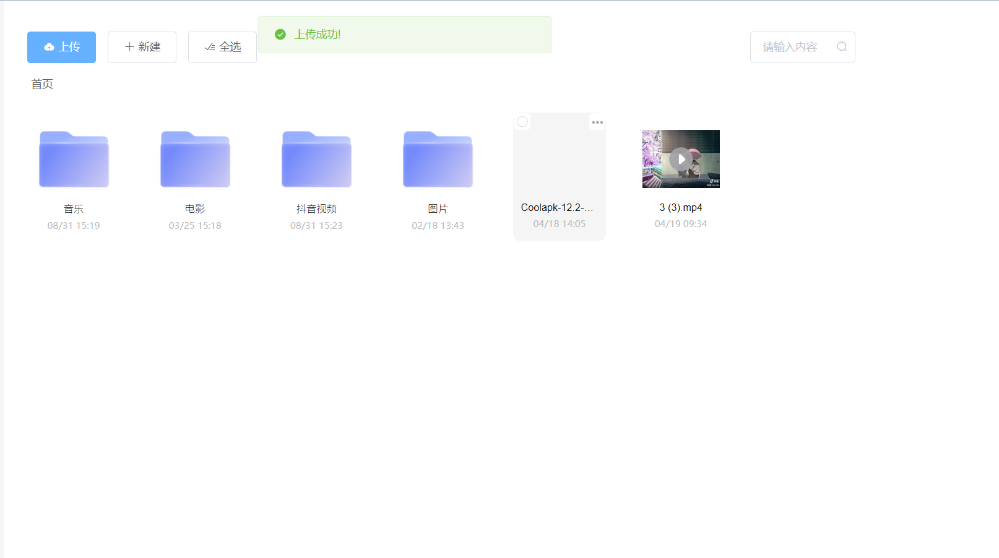
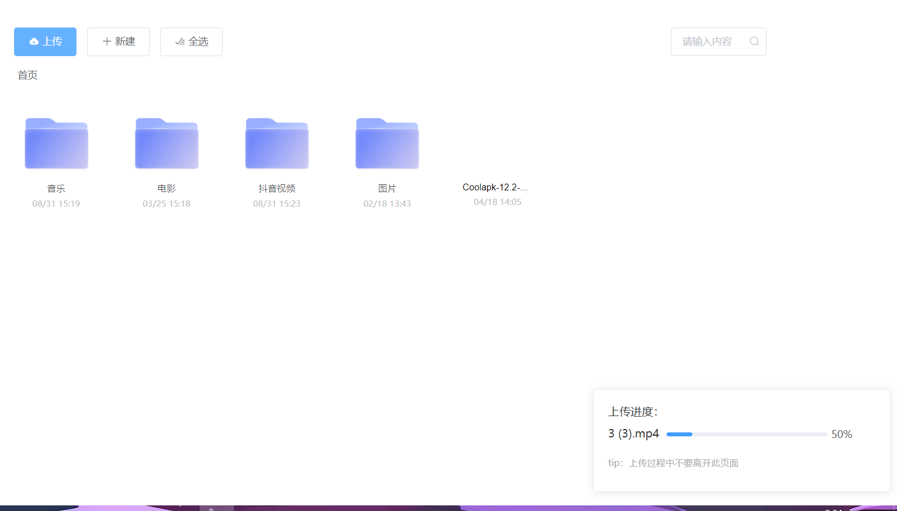
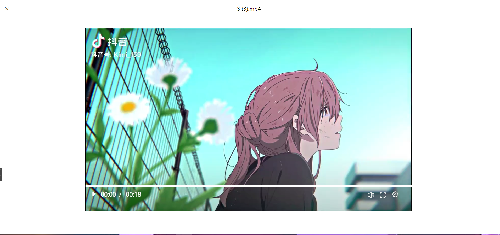
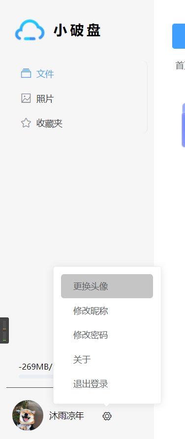
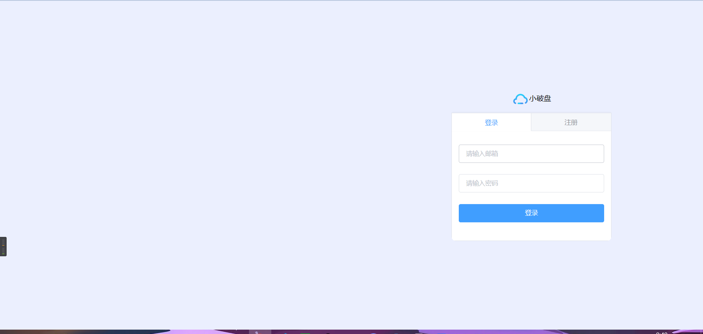

### 小破盘

本项目技术栈，前端：vue element-ui vuex vue-router

后端：mysql nodejs express 

后台：（正在写。。。）打算用React写

[在线预览](http://drive.xiezy.top)

***预览账号***
>   账号：test@gmail.com
>
>  密码：test12345678
>
首页

上传文件

在线预览（目前只支持video/audio/image）

audio

video

由于这个video/controls是我学js时写的，有点low，后期打算换个好用的video播放库

用户信息

登录

***还有分享，下载......***

### 下载

> git clone或者下载zip包解压

### run serve

> npm run serve

### 打包上线
> npm run build
